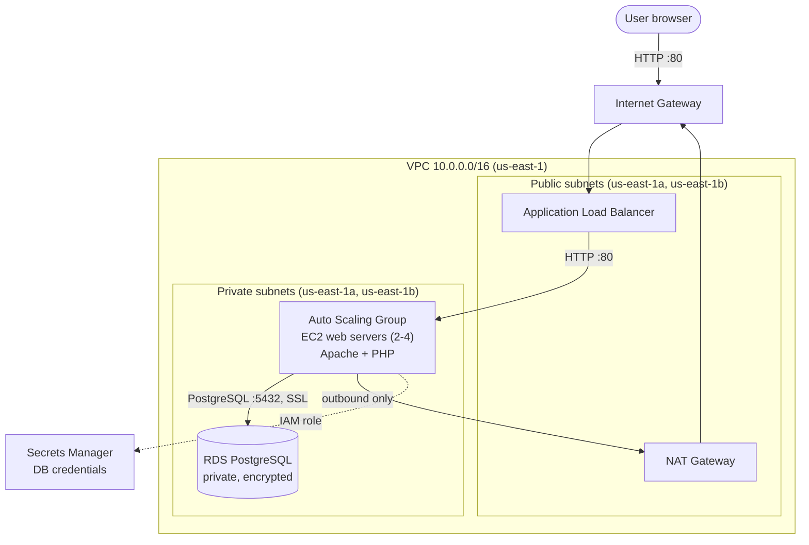

# Pitstop Multi-Tier AWS Infrastructure

Terraform code that deploys a secure, scalable, three-tier web application on AWS: an Application Load Balancer in public subnets, an Auto Scaling Group of PHP web servers in private subnets, and a private RDS PostgreSQL database whose credentials are managed by AWS Secrets Manager.

The application is **PitStop Motors Inventory**, a read-only PHP inventory listing backed by PostgreSQL.

> Originally built by hand in the AWS console as a team project (led by Hassan Ayinde), then rebuilt entirely as Infrastructure as Code with Terraform.

---

## Architecture



**Traffic flow:** Internet → ALB (public) → web servers (private) → database (private). Each tier only accepts traffic from the tier directly in front of it.

---

## Features

| Area | What's implemented |
|---|---|
| **Networking** | Custom VPC across 2 AZs, 2 public + 2 private subnets, Internet Gateway, NAT Gateway for outbound-only access from private subnets |
| **Security** | Tier-chained security groups (ALB → web → DB), stateless NACLs per subnet tier, no public IPs on servers, IAM policies scoped to project resources |
| **Database** | RDS PostgreSQL 16 in private subnets, storage encryption, SSL required, master password generated and rotated by Secrets Manager |
| **Compute** | Golden AMI pipeline, launch template, Auto Scaling Group (2–4 instances) with ELB health checks and CPU target tracking |
| **Deployments** | Changing the app, schema, or build script automatically rebuilds the AMI and rolls it out with a zero-downtime instance refresh |
| **Secrets** | No credentials in code, images, user data, or Terraform state. Instances fetch them at runtime through their IAM role |
| **Guardrails** | Terraform preconditions/postconditions (e.g. build instances can never run in a public subnet or receive a public IP) |
| **State** | Remote state and locking in HCP Terraform |

---

## Repository structure

```
.
├── main.tf                     # Root module: wires all modules together
├── provider.tf                 # Terraform/provider versions, HCP Terraform backend, default tags
├── outputs.tf                  # website_url
├── app/                        # PHP application (uploaded to S3, baked into the AMI)
│   ├── index.php
│   └── assets/inventory.css
├── db/
│   └── schema.sql              # Idempotent schema + sample data
└── modules/
    ├── networking/             # VPC, subnets, IGW, NAT, route tables
    ├── security/               # Security groups, rules, NACLs (fully data-driven)
    ├── database/               # DB subnet group, RDS PostgreSQL
    └── compute/                # S3, IAM, golden AMI pipeline, launch template, ALB, ASG
        ├── builder_user_data.sh    # Runs on the builder: install, deploy site, load schema
        └── web_user_data.sh        # Runs on every web server: fetch DB credentials
```

---

## How the compute layer works

The web servers boot from a **golden AMI** that already contains Apache, PHP and the application, so new instances are ready in seconds.

```
terraform apply
  │
  ├─ 1. Upload app/ to S3 (site/) and schema.sql to S3 (db/)
  ├─ 2. Launch a builder EC2 in a private subnet. Its user data:
  │       - installs Apache, PHP, psql
  │       - downloads the site into /var/www/html
  │       - fetches DB credentials from Secrets Manager and runs schema.sql
  │       - shuts itself down
  ├─ 3. Wait until the builder is stopped (local AWS CLI waiter)
  ├─ 4. Capture the stopped builder as the golden AMI
  ├─ 5. New launch template version points at the new AMI
  └─ 6. ASG instance refresh replaces web servers in rolling batches
```

At boot, each web server runs `web_user_data.sh`, which reads the DB username and password from Secrets Manager and writes `/etc/pitstop/db.json` (readable only by root and Apache). A cron job refreshes it every 5 minutes to follow automatic password rotation. The PHP app reads its connection details from that file.

A **content hash** of `app/`, `schema.sql` and the builder script drives the pipeline: if nothing changed, no rebuild happens; if anything changed, the whole chain runs automatically.

---

## Prerequisites

- **Terraform** 1.12.x (see `provider.tf`)
- **AWS CLI v2**, installed locally. The pipeline's wait step runs on your machine
- An **AWS account** and an IAM user for Terraform (permissions below)
- An **HCP Terraform** account (free tier is fine)

---

## Setup

### 1. Clone the repository

```bash
git clone https://github.com/HassanTaiwo185/Pitstop_Multi-Tier_AWS_Infrastructure.git
cd Pitstop_Multi-Tier_AWS_Infrastructure
```

### 2. Point it at your HCP Terraform organization

In `provider.tf`, change the `cloud` block to your own organization and workspace name:

```hcl
cloud {
  organization = "YOUR_ORG"
  workspaces {
    name = "Pitstop_Multi-Tier_AWS_Infrastructure"
  }
}
```

Then log in:

```bash
terraform login
```

In the HCP Terraform workspace, set **Settings → General → Execution Mode** to **Local**. The AMI pipeline runs an AWS CLI command on the machine running Terraform.

### 3. Create the Terraform IAM user

Create an IAM user (e.g. `terraform`) with an access key, and attach this inline policy. It is limited to `us-east-1` and to resources whose names end in `-pitstop`.

<details>
<summary>IAM policy (click to expand)</summary>

```json
{
  "Version": "2012-10-17",
  "Statement": [
    {
      "Sid": "PitstopInfrastructure",
      "Effect": "Allow",
      "Action": [
        "ec2:*",
        "elasticloadbalancing:*",
        "autoscaling:*",
        "cloudwatch:*",
        "rds:*",
        "ssm:GetParameter",
        "ssm:GetParameters"
      ],
      "Resource": "*",
      "Condition": {
        "StringEquals": { "aws:RequestedRegion": "us-east-1" }
      }
    },
    {
      "Sid": "ServiceLinkedRoles",
      "Effect": "Allow",
      "Action": "iam:CreateServiceLinkedRole",
      "Resource": "*",
      "Condition": {
        "StringLike": {
          "iam:AWSServiceName": [
            "elasticloadbalancing.amazonaws.com",
            "autoscaling.amazonaws.com",
            "rds.amazonaws.com"
          ]
        }
      }
    },
    {
      "Sid": "RdsManagedSecret",
      "Effect": "Allow",
      "Action": [
        "secretsmanager:CreateSecret",
        "secretsmanager:TagResource",
        "secretsmanager:DescribeSecret",
        "secretsmanager:DeleteSecret",
        "kms:DescribeKey"
      ],
      "Resource": "*",
      "Condition": {
        "StringEquals": { "aws:RequestedRegion": "us-east-1" }
      }
    },
    {
      "Sid": "PitstopAppBucket",
      "Effect": "Allow",
      "Action": "s3:*",
      "Resource": [
        "arn:aws:s3:::app-*-pitstop",
        "arn:aws:s3:::app-*-pitstop/*"
      ]
    },
    {
      "Sid": "PitstopInstanceRole",
      "Effect": "Allow",
      "Action": [
        "iam:CreateRole", "iam:DeleteRole", "iam:GetRole", "iam:TagRole", "iam:UntagRole",
        "iam:PassRole",
        "iam:AttachRolePolicy", "iam:DetachRolePolicy",
        "iam:PutRolePolicy", "iam:GetRolePolicy", "iam:DeleteRolePolicy",
        "iam:ListRolePolicies", "iam:ListAttachedRolePolicies", "iam:ListInstanceProfilesForRole",
        "iam:CreateInstanceProfile", "iam:DeleteInstanceProfile", "iam:GetInstanceProfile",
        "iam:TagInstanceProfile", "iam:AddRoleToInstanceProfile", "iam:RemoveRoleFromInstanceProfile"
      ],
      "Resource": [
        "arn:aws:iam::*:role/*-pitstop",
        "arn:aws:iam::*:instance-profile/*-pitstop"
      ]
    }
  ]
}
```

</details>

### 4. Export credentials

```bash
export AWS_ACCESS_KEY_ID="..."
export AWS_SECRET_ACCESS_KEY="..."
export AWS_REGION="us-east-1"
```

Never commit these. Run `terraform` in the same terminal, since the AMI wait step uses them too.

### 5. Deploy

```bash
terraform init
terraform plan
terraform apply
```

The first apply takes roughly **15–20 minutes** (RDS alone takes about 6). When it finishes, Terraform prints the site address:

```
website_url = "http://alb-pitstop-XXXXXXXXX.us-east-1.elb.amazonaws.com"
```

Give the instances 2–3 minutes to pass their health checks, then open the URL.

---

## Updating the application

Edit anything in `app/` or `db/schema.sql`, then:

```bash
terraform apply
```

The changed content hash triggers a new builder, a new AMI, a new launch template version, and a rolling instance refresh. At least 50% of instances keep serving traffic throughout. Follow progress under **EC2 → Auto Scaling Groups → web-asg-pitstop → Instance refresh**.

`schema.sql` runs on every build, so it must stay **idempotent**: use `IF NOT EXISTS` for objects and `ON CONFLICT DO NOTHING` for seed rows.

---

## Security design

- **Network isolation:** web servers and the database live in private subnets with no public IPs. The only public entry point is the ALB on port 80.
- **Least-privilege traffic:** security groups reference each other rather than IP ranges, so only the ALB can reach the web servers and only the web servers can reach PostgreSQL.
- **Defence in depth:** NACLs add a stateless subnet-level layer on top of security groups.
- **Secrets:** RDS generates the master password and stores it in Secrets Manager (encrypted with the `aws/secretsmanager` KMS key). Each instance role can read exactly one secret. The builder disables shell tracing while handling the password and wipes its cloud-init logs before imaging.
- **Instance access:** no SSH keys and no port 22. Debugging is done through AWS Systems Manager Session Manager.
- **IMDSv2** is required on all instances.
- **Private S3:** the app bucket blocks all public access. The schema is stored outside the web root prefix.

---

## Troubleshooting

| Symptom | Where to look |
|---|---|
| Apply hangs at `wait_for_builder` and times out | The builder script failed before shutting down. Connect to `builder-pitstop` with Session Manager and run `sudo tail -50 /var/log/cloud-init-output.log` |
| Site shows HTTP 500 | On a web server: `sudo tail -20 /var/log/php-fpm/www-error.log` |
| "Inventory is temporarily unavailable" | Database connection problem. Check `sudo jq 'del(.password)' /etc/pitstop/db.json` on a web server |
| Targets unhealthy in the target group | Check `/health.html` exists and Apache is running: `systemctl status httpd` |
| `403 ... not authorized` during apply | The Terraform IAM user is missing a permission from the policy above |

---

## Cost and teardown

The main costs are the **NAT Gateway**, the **ALB**, **EC2 instances** beyond free-tier hours, and **RDS**. The original console-built design was estimated at about **$201/month** with the AWS Pricing Calculator. RDS uses free-tier-eligible settings (`db.t4g.micro`, 20 GB, single-AZ).

To stop all charges:

```bash
terraform destroy
```

Everything can be recreated with `terraform apply`.

---


## Author

**Hassan Ayinde**
